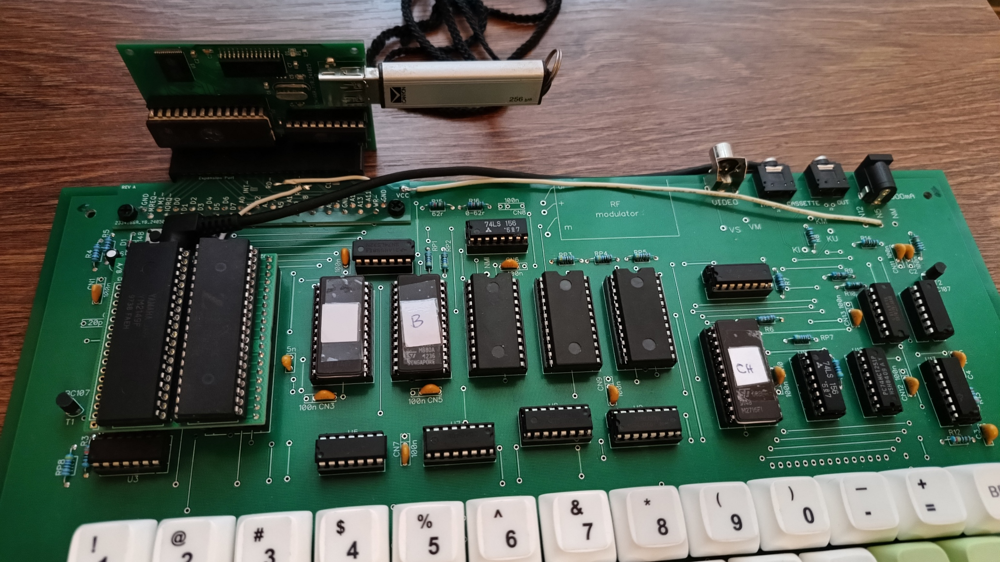

# Galaksija Resources

This repository contains various resources for retro computer [Galaksija](https://en.wikipedia.org/wiki/Galaksija_(computer)) (eng. Galaxy). Most of this stuff is not available nowhere else and is created or at least adapted by me.

## Expansion Slot PCB

Many, if not most classical Galaksija computers are made without expansion port connector. This edge connector is originally meant to be made as two sided PCB soldered on top of the one sided motherboard.

This repository contains Gerber files for PCB manufacturing for this kind of edge connector. It is designed to be backward compatible with original edge PCB connector but has some additional signal pins, as well as a power supply (VCC) pin which were omitted in the original design. These additional signals and VCC must be brought with wires and soldered to the expansion connector PCB at marked solder pads (e.g. `READ` CPU signal should be soldered to pad marked as `RD-`). As an addition, in comparison to the original edge PCB connector, this connector has some extra ground (GND) pins provided.

PCB image shown bellow shows top side look of the expansion connector PCB. This is also the top side of the board (visible side) after it is soldered to the motherboard. Although may seem obvious, this is important to note because if soldered in the reverse orientation, both device plugged to the connector and the motherboard may end up damaged!

There are two sizes of the board, with different port depths. Deeper version, shown on the second picture bellow, is about 5 millimeters deeper. Choose one which better suits your case (pun intended). If you have a Galaksija without a case, or have a case with thin walls right next to the motherboard's edge, than shallower version may be better choice. On the other hand, if your computer has a case with thick walls or has some gap between motherboard and the case wall, than choose deeper version. The other aspect you may take into account is how big is opening on your case for the expansion slot. If opening is big enough for female edge connector, when plugged, to slide into the case to some extent, than you may choose smaller version, and if opening is too small, than better to choose deeper PCB version.

> Mounting holes may not exactly match with mounting holes on some old one sided main Galaksija PCBs. It's usually not a big deal because solder joints alone will hold edge PCB connector firmly attached to the main PCB.

Next image shows a port pinout looking from the outside towards the connector.

## ROM Binary Files

ROM binary files at this repository are ROM A and ROM B files for classical Galaksija computers with ROM A changed to support keyboard layout identical to layout of newer Galaksija 2024. This layout is more favorable because it allows use of standard PC keyboard keycaps. With this ROM A patch, use of standard keycaps is now possible also for old/classical Galaksijas.

## ROM Source Files

ROM A and ROM B source files are ROM assembly source code files for classical Galaksija. This version of ROM A source file has many additional comments and many addresses changed to more readable symbolical form, while ROM B source is equal to official source available as a PDF file and has only original comments in Serbian language.

## Bin2Gtp

Bin2Gtp is a Windows executable program which wraps binary file into the GTP (Galaksija Tape Program) file format and is initially written by Tomaž Šolc. However, version published here has additional functionality to support creating a GTP file solely from a binary file, without any BASIC code. As a requirement, it needs Microsoft Visual C/C++ 2022 Redistributable package installed. For more information on usage of this command enter `bin2gtp -help` line in command prompt window.

## Machine Code Monitor

This is assembly source code for the machine code monitor program originally written by Voja Antonić in year 1984 and published in a computer magazine as a hex dump.

This version has rewritten disassembler part of the code. It now uses a bit more memory then before (about 2.5KByte vs 2KByte) for additional tables for instruction opcodes but actual disassembler code is much smaller then in original program. Of course, disassembler source code is also much more readable now.

## G2024 YM2149 Sound Generator

This is the sound generator project for both Galaksija 2024 and original Galaksija from year 1984, made with Yamaha YM2149 sound chip. Schematics is similar to sound expansion schematic for PVV Galaksija Plus. Only one difference is that it additionally uses A6 address line, so that it can work simultaneously with [flash drive expansion](https://github.com/DigitalVS/Galaxy-Flash-Expansion). This change does not break compatibility with all existing programs which are using base I/O address &00 (sound generator project for old Galaksija) or &BE (for Galaksija Plus) for the sound chip.

Sound chip externally uses the same clock as the CPU. This frequency is too high for the AY-3-8910 and it cannot be used instead of YM2149 (although many AY-3-8910 available at Aliexpress and eBay are relabeled YM2149 and would work though).

The PCB has additional seventeen solder pads on one of the edges. First pad in the corner of the PCB is a GND pad, and the rest of them are for two 8-bit I/O ports of YM2149 chip.

G2024 YM2149 folder contains Gerber files, schematics and BOM list, needed for making this sound generator.

### BASIC Support for Sound on Galaksija 2024

BASIC for Galaksija 2024 has no means to send data to the sound chip. Old Galaksija at least could use OUT command for such purposes but that command was thrown out from Galaksija's 2024 BASIC. Galaksija Plus has had a SOUND command and that simple command is recreated here in form of external program which has to be loaded and activated after every computer startup. Then the SOUND BASIC command will be available until computer is turned-off.

Command syntax is `SOUND <register>,<value>` where \<register\> is YM2149 register number from 0 to 15 and \<value\> is value from 0 to 255 to be written to the chosen register.

After loading program from SOUND.GTP file into the memory, SOUND command is not yet active. It has to be activated before first use by issuing `A=USR(&7000)` from the command prompt.

GTP file transferred from PC via USB-serial connection, should be saved to the EEPROM with `SAVE SOUND,&7000,&7047` command.

> Your may've been noticed that program is loading to unusual memory address &7000 and not as expected to the top of the RAM. This is because saving and/or loading programs from EEPROM to address &8000 and up, is not working properly on Galaksija 2024.

### Old Galaksija with G2024 YM2149 Expansion

As already being said, although primarily intended for Galaksija 2024, this  expansion will work fine with old Galaksija version, too. This is also convenient way to have both sound generator and [Galaxy Space Expansion](https://github.com/DigitalVS/Galaxy-Flash-Expansion) (GSE) connected at the same time, one to the CPU slot and the other to the expansion port on the back side of the motherboard, as it is shown on the next picture.

The MIT License (MIT)

Copyright (c) 2025 Vitomir Spasojević (<https://github.com/DigitalVS/Galaxy-Resources>). All rights reserved.
